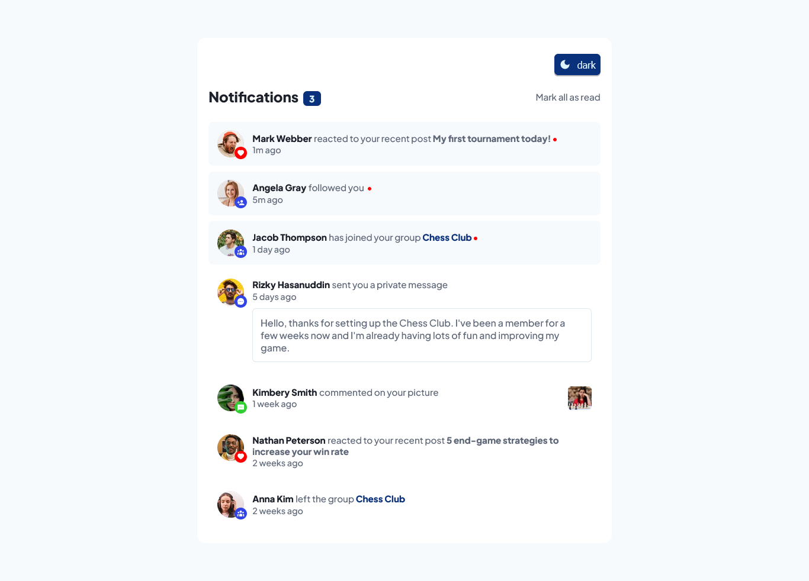
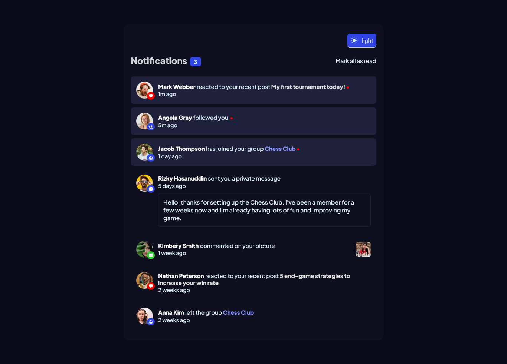

# Frontend Mentor - Notifications page solution

This is a solution to the [Notifications page challenge on Frontend Mentor](https://www.frontendmentor.io/challenges/notifications-page-DqK5QAmKbC). Frontend Mentor challenges help you improve your coding skills by building realistic projects.

## Table of contents

- [Overview](#overview)
  - [The challenge](#the-challenge)
  - [Screenshot](#screenshot)
  - [Links](#links)
  - [Built with](#built-with)
  - [What I learned](#what-i-learned)
  - [Continued development](#continued-development)
  - [Useful resources](#useful-resources)
- [Author](#author)
- [Acknowledgments](#acknowledgments)

## Overview

### The challenge

Users should be able to:

- Distinguish between "unread" and "read" notifications
- Select "Mark all as read" to toggle the visual state of the unread notifications and set the number of unread messages to zero
- View the optimal layout for the interface depending on their device's screen size
- See hover and focus states for all interactive elements on the page

### Screenshot

##### light mode



##### dark mode



### Links

- Solution URL: [Github Repo](https://github.com/jonathan401/FEM-Notification-Page)
- Live Site URL: [Deployed using vercel](https://fem-notification-page-jonathan401.vercel.app/)

### Built with

- Semantic JSX markup
- Mobile-first workflow
- [React](https://reactjs.org/) - JS library
- [Styled Components](https://styled-components.com/) - For styles

### What I learned

- More about how Typescript works

- How to conditionally style components based on typed props in styled components

```ts
export const StyledComponent = styled.div<{ bg: bgType }>`
  background-color: ${({ bg }) => bg};
`;
```

- How to add theming using the styled component's `Theme Provider Component`

- How to define types for contexts with default values

```ts
const ThemeContext = createContext<ThemeContextType | null>(null);
```

- You have to cast a type for a dynamic key

```ts
const Icon = iconMap[notificationType as keyof iconProps].icon;
```

- define type for `createGlobalStyle` function from `styled components`

```ts
const GlobalStyle = createGlobalStyle<{ theme: themeProps }>`
```

### Continued development

- Make the `ThemeToggle` component more accesible as well as the whole app

### Useful resources

- [Theming](https://jscircle.com/react-theme-switching-with-context-api-and-styled-components/) - This is a really wonderful article that helped me understand how to add theme to react apps using styled components. I really liked this pattern and will use it going forward.
- [React Context and Typescript](https://www.example.com) - This is an amazing article which helped me finally understand how to use React Context and Typescript in a React Typescript app. I'd recommend it to anyone still learning this concept.

- [Creating accessible toggle](https://www.w3.org/WAI/ARIA/apg/patterns/switch/) - This article helped me create an accessible toggle component

- [Stackoverflow](https://stackoverflow.com/questions/57086672/element-implicitly-has-an-any-type-because-expression-of-type-string-cant-b) - A stackoverflow solution to the error _Element implicitly has an `any` type because expression of type `string` can't be used to index_ helped me out when I got a similar error. I discovered that Typescript understands a `dynamic key` may have any value and so Typescript throws an error. To solve this, you must cast the `dynamic key` as a type of the `object type` or in this case, the `iconprops` interface.

## Author

- Github - [Jonathan Gomina](https://www.your-site.com)
- Frontend Mentor - [@jonathan401](https://www.frontendmentor.io/profile/jonathan401)
- Twitter - [@GominaKehinde4](https://twitter.com/GominaKehinde4)

## Acknowledgments

- [Adriano Escarabote's](https://www.frontendmentor.io/profile/AdrianoEscarabote) dark theme feature on his [Skilled E Landing page](https://adrianoescarabote.github.io/skilled-elearning-landing-page/) Frontend Mentor solution

- [Karol's](https://www.frontendmentor.io/profile/karolbanat) Frontend Mentor [Notification page solution](https://karolbanat.github.io/notifications-page/).
